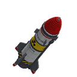

# ☢ MagicNuke

A Paper plugin for Minecraft Java **1.21.11** that adds launchable nukes. You get a special TNT that sets up as a detailed 3D missile standing straight up. When you light it, it counts down, blasts off into the sky, flips over at the top and whistles back down. When it hits the ground it goes off in a huge explosion with a 3D mushroom cloud.

**It's all in one jar.** The 3D models and textures are built into the plugin. The plugin runs a tiny download server and sends the pack to players when they join, so you don't need to upload anything.

<p align="center"></p>

## Install

1. Put `MagicNuke-1.0.0.jar` in your server's `plugins/` folder. You need **Paper (or a Paper fork) 1.21.11** and **Java 21**.
2. **Open TCP port `8163`** on your server/router/host, the same way your game port is open. Players download the resource pack from this port. You can change the port in `config.yml`.
3. Restart the server. Players get a prompt to download the pack when they join.

> **Can't open another port?** Some hosts only give you one port. Upload `plugins/MagicNuke/MagicNuke-ResourcePack.zip` to a file host with direct download links (for example [mc-packs.net](https://mc-packs.net)). Then put the link in `pack.external-url` in `config.yml` and run `/nuke reload`. You can also put the zip in your own `resourcepacks` folder to use it yourself.

## How to use it

1. `/nuke give tsar`: get a nuke (op only).
2. **Right-click the ground** to set it up. The nuke stands upright on the spot.
3. **Light it** with Flint and Steel or a fire charge, or give it a **redstone signal** (lever, button, pressure plate...). A normal TNT explosion next to it also lights it, and dispensers can fire nukes.
4. Run. 🏃

**Punch** a nuke that isn't lit to pick it back up.

### What happens

| Stage | What you see and hear |
|---|---|
| **Countdown** | The missile shakes harder and harder, with sparks and smoke. A klaxon sounds and everyone nearby sees *"☢ NUCLEAR LAUNCH DETECTED ☢ — Liftoff in 3..."*. |
| **Liftoff** | A blast of smoke rolls across the ground. Fire and smoke pour from the engine, leaving a long smoke trail as the missile spins upward. |
| **Apex** | The engine cuts out and the missile slowly flips nose-down. A war horn sounds and players get an *"INCOMING — Take cover!"* warning. |
| **Fall** | It picks up speed with a falling whistle and a glowing hot nose. A red target ring on the ground closes in on ground zero. |
| **Detonation** | A white screen flash, then the fireball. The boom reaches far-away players later, like real sound. Screens shake, debris flies everywhere, and a shockwave ring races across the ground throwing mobs and players. |
| **Mushroom cloud** | A 3D fireball rises and cools into a churning cap on a smoky stem, with a dust surge along the ground and lightning in the cloud. |
| **Aftermath** | A crater with a ragged edge and a lining of magma, obsidian, basalt and blackstone. The ground around it is scorched, sand turns to glass and fires burn. Ash falls, the sky darkens, and a Geiger counter clicks near ground zero (radiation poisons you). |

## Nuke sizes

| Size | Name | Crater radius | Flies up |
|---|---|---|---|
| `mini` | Mini Nuke | 8 | 45 |
| `small` | Tactical Nuke | 16 | 65 |
| `medium` | Atomic Bomb | 26 | 85 |
| `large` | Hydrogen Bomb | 40 | 105 |
| `tsar` | Tsar Bomba | 60 | 130 |

Bigger nukes also have a bigger missile model. You can also use any number as the size for a custom radius, like `/nuke give 33`. You can add or change sizes in `config.yml`.

## Commands

Aliases: `/nukes`, `/magicnuke`

| Command | Permission | What it does |
|---|---|---|
| `/nuke give <size\|radius> [amount] [player]` | `magicnuke.admin` | Give nukes |
| `/nuke launch <size\|radius> [x y z] [world]` | `magicnuke.admin` | Set up and launch a nuke right away, at the block you're looking at or at coordinates |
| `/nuke strike <size\|radius> [player \| x y z]` | `magicnuke.admin` | Drop a nuke out of the sky onto a spot |
| `/nuke sizes` | — | List the sizes |
| `/nuke list` | `magicnuke.admin` | Placed and flying nukes |
| `/nuke clear [radius]` | `magicnuke.admin` | Remove placed nukes |
| `/nuke pack [player]` | `magicnuke.pack` | Send the resource pack again |
| `/nuke reload` | `magicnuke.admin` | Reload `config.yml` |

`magicnuke.use` (everyone by default) lets players place, light and pick up nukes.

## Config

Everything is in `plugins/MagicNuke/config.yml` and commented. Some of the settings:

- `explosion.break-blocks`: set to `false` for effects only, with no crater.
- `explosion.max-millis-per-tick`: the crater is carved over several ticks so the server doesn't freeze. Lower this if big nukes lag.
- `explosion.flash`, `screen-shake`, `nausea`, `fallout`, `radiation`, `mushroom-cloud`, `debris`: turn each effect on or off.
- `explosion.disabled-worlds`: worlds where nukes don't work.
- `pack.*`: resource pack hosting (port, public address, external URL, required or optional).

## Building

```bash
./gradlew -p MagicNuke build
# -> MagicNuke/build/dist/MagicNuke-1.0.0.jar
# -> MagicNuke/build/dist/MagicNuke-ResourcePack.zip
```

The resource pack in `src/main/pack` is generated by `tools/generate_pack.py`. The script builds the rounded missile from rotated slabs and paints the textures in code. To change the look, edit the script and run `pip install pillow numpy && python3 tools/generate_pack.py --preview`. The previews go to `build/preview`.

`tools/smoke-test.sh` starts a real Paper server with the plugin and fires a few nukes from the console. CI runs it on every push.
