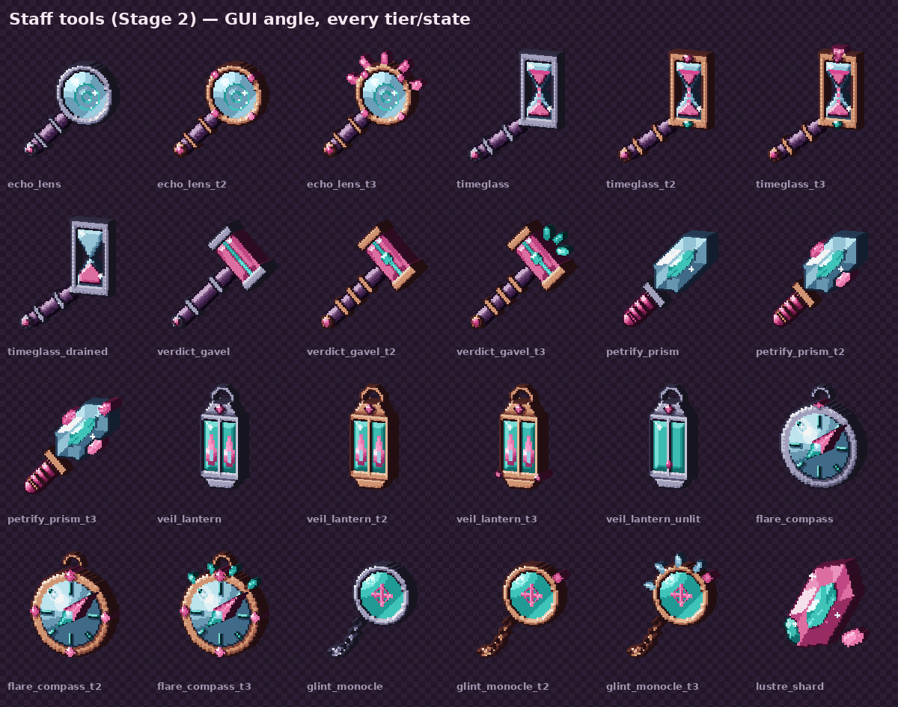
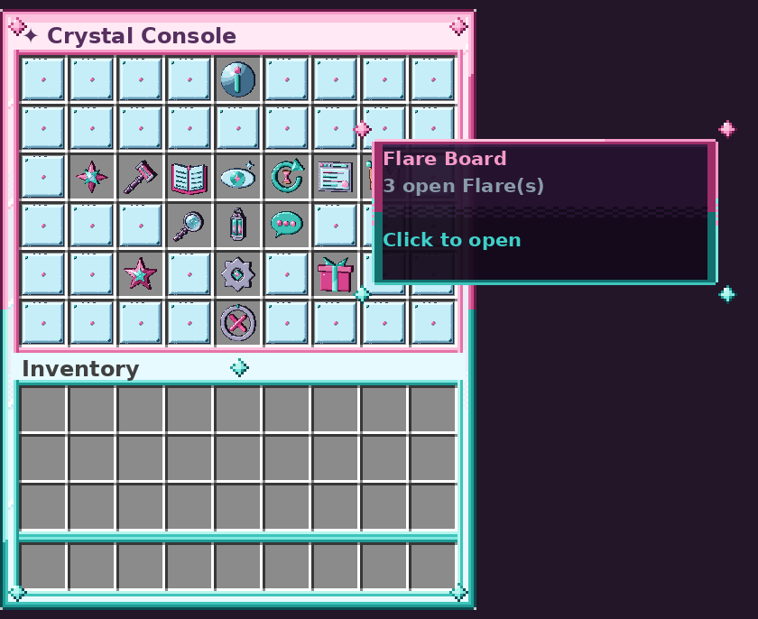

# ✦ Shardwatch

**A crystal staff and moderation suite for Paper 1.21.11**, with its own resource pack: 64×64 pixel art, 3D models,
animated emissive glow, LabPBR maps for shader packs, custom sounds and crystal particles.



| Feature | Shardwatch name | In short |
|---|---|---|
| Reports with a GUI | **Flares** | `/flare <player>` opens a category picker. Staff get alerts, then claim, teleport, resolve or dismiss on the **Flare Board**. |
| Punishments with history | **Verdicts** + **Ledger** | Chip (warn), Hush (mute), Eject (kick), Encase (ban, timed or permanent) and Petrify (freeze). Every verdict is saved and can be revoked. |
| Griefing rollback | **Echoes** + **Rewind** | Logs block place, break, explosions, fire, buckets and mob griefing. `/rewind` restores them in batches, skips blocks that changed since, and can be undone. |
| X-ray alerts | **Glint** | Counts ore *veins* against blocks mined, weights ores that were hidden in stone, alerts staff and keeps a history. |
| Staff ranks | **Facets** | Shardling → Prismkeeper → Lumenwarden → Crownfacet. Ranks are defined in config, grant permissions without another plugin, and add chat prefixes and sigils. Includes **Hum** staff chat and **Veil** vanish. |
| Web-style log viewer | **Shardscope** | A book with tab navigation (Overview · Blocks · Chat · Verdicts · Flares · Glint · Staff), hover cards, click-to-teleport, filters and a pager. |
| Admin tools | 7 staff tools | Echo Lens, Timeglass, Verdict Gavel, Petrify Prism, Veil Lantern, Flare Compass, Glint Monocle. |
| Progression | **Lustre** | Earn Lustre for staff work, reach Clarity levels, refine tools to tiers II–III, and claim Keepsakes (auras, chat sigils, Lustre Shards). |

## Install

1. Put `Shardwatch-1.0.0.jar` in `plugins/`. You need **Paper 1.21.11** and **Java 21**. On first start Paper downloads the SQLite driver it needs.
2. Point the server at the resource pack (next section).
3. Give yourself a rank with `/facet set <you> crownfacet` (as op or from the console), then run `/sw` to open the **Crystal Console**.

## Resource pack: automatic download

Every push to the default branch rebuilds the pack in GitHub Actions and publishes it to the rolling `pack-latest` release.
Add this to `server.properties`:

```properties
resource-pack=https://github.com/somethingenteryourname-ui/magic-magma/releases/download/pack-latest/Shardwatch-pack.zip
resource-pack-sha1=713f3da0ea625ba9b522bbd89c88ea2ed1037c5f
require-resource-pack=true
resource-pack-prompt={"text":"Shardwatch crystal pack: staff tools, menus, sounds","color":"#F59AC8"}
```

The SHA-1 above matches the pack in this commit. The zip is built reproducibly (fixed timestamps and file order), so the
hash only changes when the pack content changes. Each CI run prints the current hash in its job summary and the release notes.
`./gradlew :shardwatch:packZip` builds the zip locally into `build/pack/` and writes `Shardwatch-pack.zip.sha1` next to it.

Other ways to deliver it (`pack:` in `config.yml`):

* `pack.send: true` makes the plugin push the pack on join. With `pack.sha1: auto`, it downloads the zip once at startup and computes the hash, so it never goes stale.
* `pack.host.enabled: true` serves `plugins/Shardwatch/Shardwatch-pack.zip` from a small built-in web server. Use this if your GitHub repository is **private**, because release assets of private repositories can't be downloaded by players.
* `/sw pack [player]` resends the pack. `/sw pack status` shows the URL and hash in use.

Players without the pack still get a working plugin. Tools fall back to amethyst shards, menu icons to matching vanilla
items, and every sound preset has a vanilla fallback (`fx.sound-mode: auto` picks per player from their pack status).

## Look & textures

| Requirement | How it's met |
|---|---|
| Clear pinks and teals, shiny facets | Every pixel comes from seven 8-step ramps (pink, rose, teal, ice, silver, rose-gold, plum). Gems are drawn as planar facets with specular sparkles. |
| 64×64 with careful shading | One light from the top-left, quantised onto the ramps with ordered dithering, cast shadows, and selective outlines (lighter on lit edges). |
| 3D models | Extruded relief models with real depth per part (Blockbench Java format), display angles for hand, GUI, ground, head and frame. Editable `.bbmodel` projects are in [`blockbench/`](blockbench). |
| Animated + emissive | Glowing parts are overlay planes with `light_emission: 15` and animated `.mcmeta` strips: falling Timeglass sand, lantern flame, shimmer sweeps. |
| LabPBR | Every texture and glow frame has a `_n` (normal, AO, height) and `_s` (smoothness, F0/metal ids, SSS, emission) map. |
| Particles & sounds | Crystal particles through `Particle.ITEM` + `item_model`, 32 synthesised sounds with subtitles, and animations built from item displays. |
| No vanilla replaced | Everything uses `item_model` / custom fonts in the `shardwatch` namespace; nothing is under `assets/minecraft/`. |

The full pack folder layout is in [docs/RESOURCE_PACK.md](docs/RESOURCE_PACK.md). Previews:
[tools](docs/previews/sheet-tools.png) · [sigils](docs/previews/sheet-badges.png) · [icons](docs/previews/sheet-icons.png) ·
[particles](docs/previews/sheet-particles.png) · [menu mock-up](docs/previews/menu-console.png) ·
[chat sigils](docs/previews/chat-sigils.png) · [sounds](docs/previews/sounds.png), plus one card per tool (texture, glow
frames, LabPBR maps, element counts) in [docs/previews](docs/previews).



## Commands

| Command | Aliases | Usage | What it does |
|---|---|---|---|
| `/shardwatch` | /sw | `/shardwatch [menu\|settings\|kit\|give\|lustre\|refine\|keepsakes\|pack\|status\|reload\|version]` | Shardwatch hub — help, menu, kit, give, reload. |
| `/flare` | /report | `/flare <player> [category] [reason]` | Send a Flare (report) about a player. |
| `/flares` |  | `/flares [list\|all\|claim\|resolve\|dismiss\|tp\|view] [id]` | Open the Flare Board. |
| `/chip` | /warn | `/chip <player> <reason> [-s]` | Chip (warn) a player. |
| `/hush` | /mute | `/hush <player> [duration] <reason> [-s]` | Hush (mute) a player. |
| `/unhush` | /unmute | `/unhush <player> [reason]` | Lift a Hush. |
| `/eject` | /kick2 | `/eject <player> <reason> [-s]` | Eject (kick) a player. |
| `/encase` | /ban2 | `/encase <player> [duration] <reason> [-s]` | Encase (ban) a player, optionally for a time. |
| `/unencase` | /unban2 | `/unencase <player> [reason]` | Lift an Encase. |
| `/petrify` | /freeze | `/petrify <player>` | Toggle Petrify (freeze) on a player. |
| `/ledger` | /history | `/ledger <player> [page] \| revoke <id> [reason]` | A player's verdict history. |
| `/echo` | /inspect | `/echo [page <n>]` | Toggle Echo inspect mode (click blocks to see their history). |
| `/rewind` | /rollback | `/rewind <player\|#source\|*> <time> [radius\|global] [-p] \| area <time> [player] \| undo` | Rewind (roll back) logged block changes. |
| `/glint` | /xray | `/glint [list\|suspects\|check\|tp\|watch\|unwatch\|handle]` | X-ray alerts. |
| `/facet` | /staffrank | `/facet [list\|set\|info]` | Staff ranks. |
| `/hum` | /sc | `/hum [message]` | Staff chat. Without a message, toggles Hum mode. |
| `/veil` | /vanish | `/veil [player]` | Toggle Veil (vanish). |
| `/scope` | /logs | `/scope [tab] [window] [u:name r:radius t:time a:action text] [--chat]` | Shardscope log viewer. |

`/sw` subcommands: `menu` (Crystal Console), `settings`, `kit`, `give <player> <tool> [tier|facet] [amount]`,
`lustre [player|top|add|take]`, `refine`, `keepsakes`, `pack [player|status]`, `status`, `reload`, `version`.

Tool ids for `/sw give`: `echo_lens`, `timeglass`, `verdict_gavel`, `petrify_prism`, `veil_lantern`, `flare_compass`,
`glint_monocle`, `lustre_shard`, `sigil` (pass a Facet id).

Verdict tips: durations look like `30m`, `2h`, `7d`, `1w2d` or `perm`. `#spam` uses a preset reason, and `-s` keeps a verdict
staff-only.

Rewind sources: a player name, `*` (everyone, needs a radius), or `#tnt`, `#creeper`, `#fire`, `#enderman`, `#wither`,
`#block-explosion`. `-p` previews (shimmering blocks), `area` uses the Timeglass selection, `undo` reverts your last rewind.

Shardscope filters: `u:<name>`, `r:<radius>`, `t:<time>`, `a:<action>` and free text, e.g. `/scope blocks u:Griefer t:2h`.

## Permissions

| Permission | Default | What it allows |
|---|---|---|
| `shardwatch.*` | op | Everything in Shardwatch. |
| `shardwatch.staff` | False | Marks a player as staff (Hum, staff counts). |
| `shardwatch.flare` | True | Send Flares. |
| `shardwatch.flare.bypass-cooldown` | op | No cooldown between Flares. |
| `shardwatch.flares.*` | op | Full Flare Board access. |
| `shardwatch.flares` | op | View the Flare Board. |
| `shardwatch.flares.handle` | op | Claim, resolve and dismiss Flares. |
| `shardwatch.flares.teleport` | op | Teleport to Flares. |
| `shardwatch.verdict.*` | op | Every verdict, including permanent ones and revoking. |
| `shardwatch.verdict.chip` | op | /chip |
| `shardwatch.verdict.hush` | op | /hush |
| `shardwatch.verdict.hush.permanent` | op | Permanent Hush. |
| `shardwatch.verdict.hush.unlimited` | op | Ignore verdicts.hush.max-duration. |
| `shardwatch.verdict.hush.revoke` | op | /unhush |
| `shardwatch.verdict.eject` | op | /eject |
| `shardwatch.verdict.encase` | op | /encase |
| `shardwatch.verdict.encase.permanent` | op | Permanent Encase. |
| `shardwatch.verdict.encase.unlimited` | op | Ignore verdicts.encase.max-duration. |
| `shardwatch.verdict.encase.revoke` | op | /unencase |
| `shardwatch.verdict.petrify` | op | /petrify (and commands while petrified). |
| `shardwatch.ledger` | op | /ledger |
| `shardwatch.ledger.revoke` | op | Revoke Ledger entries. |
| `shardwatch.echo` | op | Echo inspect mode. |
| `shardwatch.rewind` | op | /rewind within the radius and time limits. |
| `shardwatch.rewind.global` | op | /rewind without radius or time limits. |
| `shardwatch.glint` | op | /glint |
| `shardwatch.glint.watch` | op | Spectate Glint suspects. |
| `shardwatch.glint.exempt` | False | Never tracked by Glint. |
| `shardwatch.facet.manage` | op | /facet set for ranks below your own. |
| `shardwatch.facet.manage.any` | op | /facet set for any rank. |
| `shardwatch.hum` | op | Read and write Hum (staff chat). |
| `shardwatch.veil` | op | /veil |
| `shardwatch.veil.see` | op | See Veiled staff. |
| `shardwatch.veil.others` | op | /veil <player> |
| `shardwatch.scope` | op | /scope (overview, verdicts, flares, glint tabs). |
| `shardwatch.scope.*` | op | Every Shardscope tab and teleport. |
| `shardwatch.scope.blocks` | op | Shardscope Blocks tab. |
| `shardwatch.scope.chat` | op | Shardscope Chat tab. |
| `shardwatch.scope.staff` | op | Shardscope Staff (audit) tab. |
| `shardwatch.scope.teleport` | op | Click-to-teleport in Shardscope. |
| `shardwatch.notify.*` | op | Receive every staff alert. |
| `shardwatch.notify.flares` | op | Flare alerts. |
| `shardwatch.notify.verdicts` | op | Verdict announcements. |
| `shardwatch.notify.glint` | op | Glint (x-ray) alerts. |
| `shardwatch.exempt` | False | Can't receive verdicts from staff without exempt.bypass. |
| `shardwatch.exempt.bypass` | op | Judge exempt or equal/higher Facet players. |
| `shardwatch.admin.reload` | op | /sw reload |
| `shardwatch.admin.give` | op | /sw give |
| `shardwatch.admin.lustre` | op | /sw lustre add\|take and viewing others' Lustre. |
| `shardwatch.admin.pack` | op | /sw pack <player> and /sw pack status. |
| `shardwatch.kit` | op | /sw kit — receive the tools your permissions allow. |
| `shardwatch.tool.*` | op | Use every staff tool. |
| `shardwatch.tool.echo_lens` | op | Echo Lens. |
| `shardwatch.tool.timeglass` | op | Timeglass (also needs shardwatch.rewind). |
| `shardwatch.tool.verdict_gavel` | op | Verdict Gavel. |
| `shardwatch.tool.petrify_prism` | op | Petrify Prism (also needs shardwatch.verdict.petrify). |
| `shardwatch.tool.veil_lantern` | op | Veil Lantern (also needs shardwatch.veil). |
| `shardwatch.tool.flare_compass` | op | Flare Compass. |
| `shardwatch.tool.glint_monocle` | op | Glint Monocle (also needs shardwatch.glint.watch). |


Facets grant permissions themselves (`facets.grant-permissions`), with higher ranks inheriting lower ones. If you use
LuckPerms, set that to `false` and give `shardwatch.facet.<id>` plus whichever nodes you want.

## Configuration

[`config.yml`](src/main/resources/config.yml) is fully commented. Its sections are `pack`, `storage` (retention),
`verdicts` (broadcasts, presets, limits), `flares` (categories, cooldowns), `echoes`, `rewind` (limits, batch size),
`glint` (ore weights, thresholds), `facets` (ranks, chat format, sigils), `tools`, `gui`, `progression` (rewards, levels,
refinements, keepsakes), `scope` and `fx` (every sound and particle preset). All text is in
[`lang.yml`](src/main/resources/lang.yml) and uses MiniMessage. `/sw reload` re-reads both files and warns about values
it can't use.

## Building

```bash
./gradlew build                     # both plugin jars + tests + build/pack/Shardwatch-pack.zip (+ .sha1)
pip install pillow numpy soundfile pyyaml
python3 tools/generate_pack.py      # redraw every texture, model, sound and .bbmodel
python3 tools/render_previews.py    # docs/previews/*.png
python3 tools/check_pack.py --stage 6 --write   # check against the Look & textures list
python3 tools/pack_layout.py        # docs/RESOURCE_PACK.md
```

The pack is generated by code: [`tools/pixelart.py`](tools/pixelart.py) is the shading engine, and `tools/art/*.py` draws each asset.

## Developer API

```java
@EventHandler
public void onStaffAction(dev.shardwatch.api.ShardwatchActionEvent e) {
    if (e.getAction() == StaffAction.ENCASE) {
        discord.post(e.getActor() + " encased " + e.getTarget() + ": " + e.getDetail());
    }
}
```

## Notes and limits

* Built and unit-tested (SQL stores, parsers, lang keys, plugin.yml and config consistency) against the Paper 1.21.11 API. It has **not** been run on a live server yet, so test it on a staging server first.
* The menu backgrounds use the usual custom-font trick (ascent 13 and negative-space glyphs). If a client or another plugin offsets them, set `gui.custom-backgrounds: false`.
* LabPBR normals use the DirectX (Y−) convention. Flip `NORMAL_Y_DOWN` in `tools/pixelart.py` and regenerate if your shader expects OpenGL.
* Rewind restores block states. It doesn't restore chest contents or entities.
